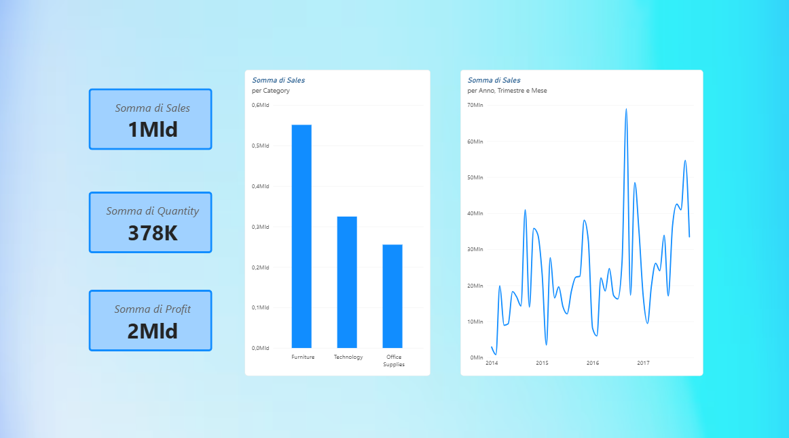

# 📊 Analisi Dati Superstore (Python & Power BI)

Un progetto di analisi dati end-to-end basato sul dataset "Superstore". L'obiettivo è mostrare un flusso di lavoro reale: partendo dalla pulizia di dati "sporchi" con Python fino a creare una dashboard interattiva in Power BI.

---

## 🛠️ Struttura del Progetto

La repository è organizzata secondo standard professionali:

superstore-project/

├── README.md          # Documentazione del progetto

├── dashboard/         # Screenshot della dashboard Power BI

├── scripts/           # Script Python per la pulizia e la gestione dei dati

└── data/              # Dataset grezzo e pulito

## 🧹 1. Data Cleaning & Engineering (Python)

Il dataset iniziale presentava diverse criticità tipiche dei file aziendali reali (formati di data errati, separatori, valori mancanti). Tramite Pandas, sono state applicate le seguenti correzioni nello script data_cleaning.py:

1. Normalizzazione delle Date: Conversione delle date con gestione robusta degli errori

2. Per la colonna Quantity, i valori nulli sono stati gestiti inserendo la moda (1).

3. Per i campi geografici (City, Ship Mode), i vuoti sono stati mappati su "SCONOSCIUTO" per preservare l'integrità del record.

4. Pulizia degli spazi in eccesso nei nomi dei clienti

## 📈 2. Power BI Dashboard & Visual Insights

I dati ripuliti sono stati importati in Power BI per realizzare una dashboard interattiva:

1. KPI Cards: Fatturato Totale (Sales), Quantità Totale (Quantity) e Profitto Totale (Profit).

2. Top Categorie: Analisi del fatturato suddiviso per categoria

3. Trend Temporale: Monitoraggio dell'andamento delle vendite nel corso del tempo.

### Anteprima della Dashboard:

---

## 🛠️ Tecnologie Utilizzate
* **Python** (Libreria Pandas) per la pulizia dei dati
* **Power BI** per la creazione della dashboard
* **GitHub** per la gestione e la pubblicazione del progetto
